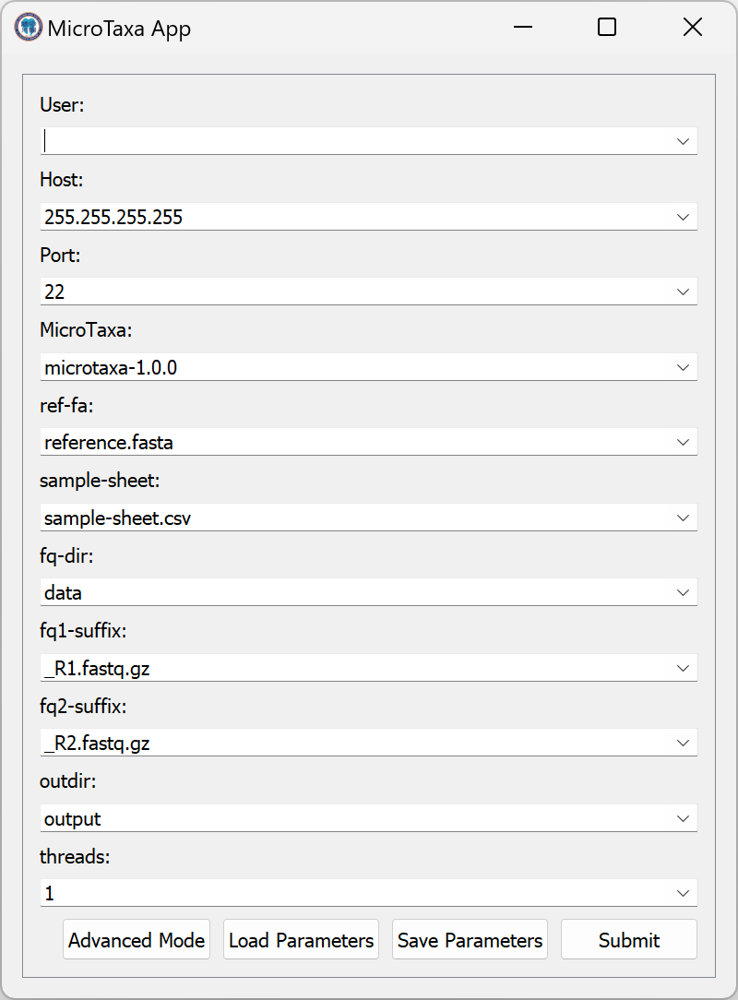

# MicroTaxa App



### Server configuration

Create a `~/MicroTaxaApp` in the user's home directory, which is the root directory of the MicroTaxaApp.
A typical directory structure is shown below:

```
~/MicroTaxaApp/
├── .bash_profile
├── fastq/
├── microtaxa-1.0.0/
├── reference.fasta
└── sample-sheet.csv
```

The `.bash_profile` defines all things needed to be activated to run the `microtaxa-1.0.0`.
An example of the `.bash_profile` is shown below:

```bash
source $HOME/anaconda3/bin/activate microtaxa
```

Other files and directories are described as the following:

- `fastq/`: Directory containing all fastq files
- `microtaxa-1.0.0/`: The executable `microtaxa` which can be downloaded from [here](https://github.com/linyc74/microtaxa/releases)
- `reference.fasta`: The reference fasta file required by the `microtaxa`
- `sample-sheet.csv`: The sample sheet file required by the `microtaxa`
